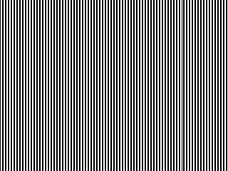
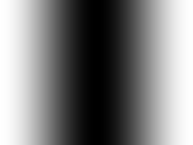
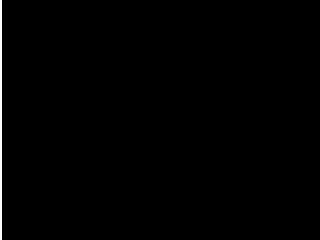

# Structured Light
These programs generate and decode structured light. 

Currently supports 
* [Binary code](#Binary-code)
* [Gray code](#Gray-code)
* [XOR code](#XOR-code)
* [Ramp code](#Ramp-code)
* [Phase Shifting](#Phase-Shifting)
* [Single stripe](#Single-stripe)

## Requirement
* Numpy

## Installation
```sh
pip install git+https://github.com/elerac/structuredlight
```

## Usage
```python
import structuredlight as sl

width  = 640
height = 480

gray = sl.Gray()

imlist_pattern = gray.generate((width, height))

# Projecting patterns from a projector (or display) and capture images
imlist_captured = imlist_pattern

img_index = gray.decode(imlist_captured, thresh=127)

print(img_index)
# [[  0   1   2 ... 637 638 639]
#  [  0   1   2 ... 637 638 639]
#  ...
#  [  0   1   2 ... 637 638 639]]
```

## Supported structured light

### Binary code

```python
binary = sl.Binary()
imlist = binary.generate((width, height))
img_index = binary.decode(imlist, thresh=127)
```

### Gray code

```python
gray = sl.Gray()
imlist = gray.generate((width, height))
img_index = gray.decode(imlist, thresh=127)
```

### XOR code

```python
xor = sl.XOR(index_last=-1)
imlist = xor.generate((width, height))
img_index = xor.decode(imlist, thresh=127)
```

### Ramp code

```python
ramp = sl.Ramp()
imlist = ramp.generate((width, height))
img_index = ramp.decode(imlist)
```

### Phase-Shifting

```python
phaseshifting = sl.PhaseShifting(num=3)
imlist = phaseshifting.generate((width, height))
img_index = phaseshifting.decode(imlist)
```

### Single stripe

```python
stripe = sl.Stripe()
imlist = stripe.generate((width, height))
img_index = stripe.decode(imlist)
```

## Tips
### How to binarize a grayscale image
Some of the code (Binary, Gray, XOR, ...) needs to binarize. This program provides three methods. [See the wiki for details.](https://github.com/elerac/structuredlight/wiki#how-to-binarize-a-grayscale-image)

### How to display images in full screen
When you use structured light, you'll need a full screen display from a projector or display. [Here is a program to display the image in full screen.](https://github.com/elerac/fullscreen)